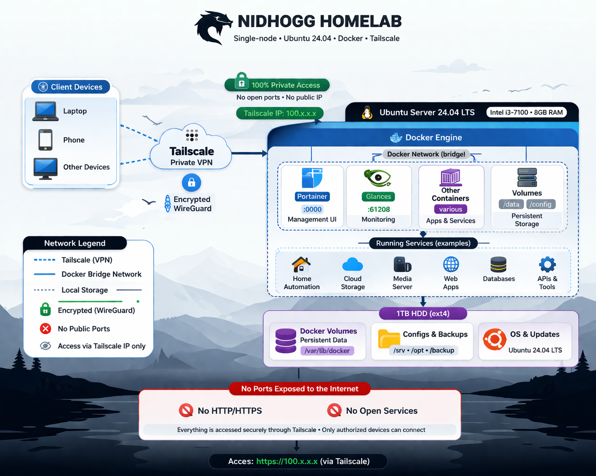

<p align="center">
  
</p>

<h1 align="center">Nidhogg Homelab</h1>

<p align="center">
  Personal homelab for learning infrastructure, Docker, and self-hosting
</p>

<p align="center">
  <a href="#overview">Overview</a> •
  <a href="#-tech-stack">Tech Stack</a> •
  <a href="#-architecture">Architecture</a> •
  <a href="#-documentation">Documentation</a>
</p>

<p align="center">
  
  
  
  
</p>

---

## Overview

This homelab is a **single-node Docker-based environment** used to experiment with self-hosting, networking, and infrastructure concepts.

It focuses on simplicity, private access, and iterative learning rather than production complexity.

---

## 🧠 Architecture

<p align="center">
  
</p>

---


## 🧱 Tech Stack

<table>
  <tr>
    <th>Logo</th>
    <th>Name</th>
    <th>Description</th>
  </tr>

  <tr>
    <td></td>
    <td><a href="https://www.docker.com">Docker</a></td>
    <td>Containerization platform for running services</td>
  </tr>

  <tr>
    <td></td>
    <td><a href="https://www.portainer.io">Portainer</a></td>
    <td>Web UI for managing Docker containers</td>
  </tr>

  <tr>
    <td></td>
    <td><a href="https://tailscale.com">Tailscale</a></td>
    <td>Private VPN for secure remote access</td>
  </tr>

  <tr>
    <td></td>
    <td><a href="https://nicolargo.github.io/glances/">Glances</a></td>
    <td>Lightweight real-time system monitoring</td>
  </tr>

  <tr>
    <td></td>
    <td><a href="https://filebrowser.org">File Browser</a></td>
    <td>Web-based file manager for server storage</td>
  </tr>

  <tr>
    <td></td>
    <td><a href="https://ubuntu.com/server">Ubuntu Server</a></td>
    <td>Base operating system</td>
  </tr>

</table>

---

## 📊 System

- **CPU**: Intel i3-7100  
- **RAM**: 8GB DDR4-3200  
- **Storage**: 1TB HDD  

---

## 🔒 Access Model

All services are accessed privately via Tailscale.  
No ports are exposed to the public internet.

---

## Project Structure

```text
homelab/
├── README.md
├── LICENSE
├── CONTRIBUTING.md
├── SECURITY.md
│
├── img/
│   ├── nidhogg_logo.png
│   └── architecture.png
│
├── docs/
│   ├── architecture.md
│   ├── networking.md
│   ├── services.md
│   ├── monitoring.md
│   ├── storage.md
│   └── hardware.md
│
├── apps/
│   ├── portainer/
│   │   └── README.md
│   ├── glances/
│   │   └── README.md
│   ├── tailscale/
│   │   └── README.md
│   └── filebrowser/
│       └── README.md
│
└── compose/
    ├── portainer.yml
    ├── glances.yml
    └── filebrowser/
        └── docker-compose.yml
```
---
## 📚 Documentation

- [Architecture](docs/architecture.md)
- [Networking](docs/networking.md)
- [Services](docs/services.md)
- [Monitoring](docs/monitoring.md)
- [Storage](docs/storage.md)
- [Hardware](docs/hardware.md)

---

## 📌 Goals

- Learn Docker networking and containerization  
- Build scalable service architecture  
- Deploy APIs and web applications  

---

## ⚠️ Status

Project status: **Active / Learning Phase**

This homelab evolves as new tools and concepts are explored.