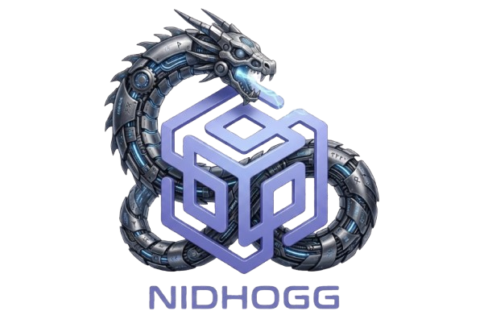
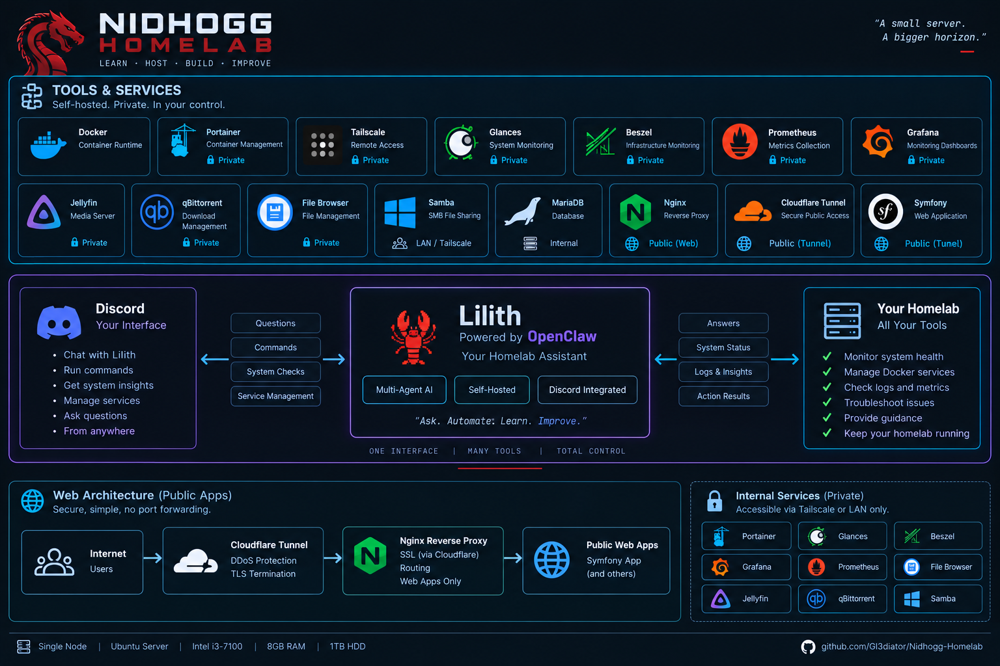
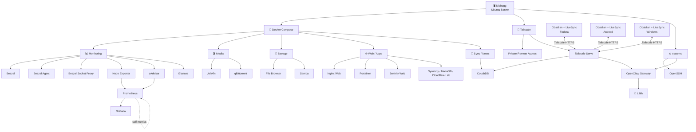

<p align="center">
  
</p>

<h1 align="center">Nidhogg Homelab</h1>

<p align="center">
  Single-node self-hosted lab for Docker, networking, infrastructure, media, monitoring, AI, and web development.
</p>

<p align="center">
  <a href="#overview">Overview</a> •
  <a href="#-services">Services</a> •
  <a href="#-architecture">Architecture</a> •
  <a href="#-documentation">Documentation</a>
</p>

<p align="center">
  
  
  
  
</p>

---

## Overview

**Nidhogg** is a single-node Ubuntu Server homelab used for learning and experimenting with:

- Docker and Docker Compose
- Linux administration
- networking and private remote access
- monitoring and observability
- self-hosted media
- storage and file sharing
- web application deployment
- reverse proxies and tunneling
- AI assistants and automation

The environment intentionally stays small and practical while providing enough infrastructure to experiment with real self-hosted services.

---

## 🧠 Architecture




Nidhogg combines Docker workloads with native host services.


```mermaid
flowchart TB
    N["🖥️ Nidhogg<br/>Ubuntu Server"]

    N --> D["🐳 Docker Compose"]
    N --> T["🔐 Tailscale"]
    N --> S["⚙️ systemd"]

    D --> MON["📊 Monitoring"]
    D --> MEDIA["🎬 Media"]
    D --> STORAGE["💾 Storage"]
    D --> WEB["🌐 Web / Apps"]
    D --> SYNC["📝 Sync / Notes"]

    MON --> B["Beszel"]
    MON --> BA["Beszel Agent"]
    MON --> BSP["Beszel Socket Proxy"]
    MON --> NE["Node Exporter"]
    MON --> CA["cAdvisor"]
    MON --> G["Glances"]

    NE --> PROM["Prometheus"]
    CA --> PROM
    PROM --> GR["Grafana"]
    PROM -. "self-metrics" .-> PROM

    MEDIA --> J["Jellyfin"]
    MEDIA --> Q["qBittorrent"]

    STORAGE --> FB["File Browser"]
    STORAGE --> SMB["Samba"]

    WEB --> NW["Nginx Web"]
    WEB --> PORT["Portainer"]
    WEB --> SW["Serinity Web"]
    WEB --> SYM["Symfony / MariaDB / Cloudflare Lab"]

    SYNC --> CDB["CouchDB"]

    T --> REMOTE["Private Remote Access"]
    T --> SERVE["Tailscale Serve"]

    SERVE --> CDB
    SERVE --> OC

    S --> SSH["OpenSSH"]
    S --> OC["OpenClaw Gateway"]

    OC --> L["💜 Lilith"]

    FED["Obsidian + LiveSync<br/>Fedora"]
    PHONE["Obsidian + LiveSync<br/>Android"]
    WIN["Obsidian + LiveSync<br/>Windows"]

    FED <-->|"Tailscale HTTPS"| SERVE
    PHONE <-->|"Tailscale HTTPS"| SERVE
    WIN <-->|"Tailscale HTTPS"| SERVE
```

Docker Compose definitions currently span:

- `/srv/compose/`
- `/srv/homelab/compose/`

OpenClaw is managed separately as a user-level systemd service.

---

## 🧱 Tech Stack

| Logo | Service | Role | Access |
| :---: | --- | --- | --- |
|  | Docker | Container runtime | Host |
|  | Portainer | Docker management UI | Private |
|  | Tailscale | Private networking and remote access | Private |
|  | Beszel | Lightweight infrastructure monitoring | Tailscale |
|  | Prometheus | Metrics collection and time-series storage | Private |
|  | Grafana | Monitoring dashboards and visualization | Private |
|  | Glances | Real-time system monitoring | Private |
|  | Jellyfin | Media server | Private |
|  | qBittorrent | Download management | Private |
|  | File Browser | Web-based file management | Private |
|  | Samba | SMB file sharing | LAN / Tailscale |
|  | Obsidian LiveSync | Cross-device Obsidian vault synchronization | Tailscale |
|  | CouchDB | Backend database for Obsidian LiveSync | Tailscale / localhost |
|  | Nginx | Web serving and reverse proxying | HTTP |
|  | OpenClaw / Lilith | Self-hosted multi-agent assistant | Tailscale |
|  | Symfony | Web application framework | Web stack |
|  | MariaDB | Relational database | Internal |
|  | Cloudflare Tunnel | Tunnel-based public web access | Public edge |
|  | Ubuntu Server | Base operating system | Host |

## 🤖 Lilith

Nidhogg hosts **Lilith**, a self-hosted multi-agent personal assistant powered by OpenClaw.

OpenClaw runs as a user-level systemd service with its application gateway bound to loopback. Private remote access is provided through Tailscale Serve.

Lilith has its own reproducibility repository:

**[Gl3diator/Lilith](https://github.com/Gl3diator/Lilith)**

---

## 🌐 Networking

Nidhogg uses several networking layers depending on the service:

- **LAN** for local services and file sharing
- **Tailscale** for private remote access
- **Docker bridge networks** for container isolation and service communication
- **Loopback bindings** for host-local infrastructure endpoints
- **Tailscale Serve** for selected private HTTPS services
- **Cloudflare Tunnel and Nginx** for web-hosting experimentation

Sensitive administration interfaces are kept away from direct public Internet exposure.

---

## 📊 Monitoring

Nidhogg uses multiple monitoring tools for different levels of visibility.

### Beszel

Beszel provides lightweight infrastructure monitoring through:

- Beszel hub
- Beszel Agent
- restricted Docker socket proxy

The Beszel web interface is available privately through Tailscale.

### Prometheus & Grafana

Nidhogg also contains a traditional metrics stack consisting of:

- Prometheus for metrics collection and storage
- Grafana for dashboards and visualization
- Node Exporter for Linux host metrics
- cAdvisor for Docker container metrics

Prometheus and Grafana are configured for private Tailscale access.

### Glances

Glances provides quick real-time visibility into:

- CPU usage
- memory usage
- disk usage
- processes
- system load

Together these tools allow Nidhogg to experiment with both lightweight monitoring and a more traditional Prometheus/Grafana observability stack.

---

## 🎬 Media & Downloads

### Jellyfin

Jellyfin provides self-hosted media streaming from Nidhogg.

### qBittorrent

qBittorrent provides download management, with its web interface available privately through Tailscale.

---

## 💾 Storage & File Access

### Samba

Samba provides network file sharing across the local network.

### File Browser

File Browser provides browser-based management of server files.

Persistent service data and Compose configuration are kept separate where practical.

---

## 🖥️ Hardware

| Component | Specification |
| --- | --- |
| **CPU** | Intel Core i3-7100 |
| **RAM** | 8 GB DDR4-3200 |
| **Storage** | 1 TB HDD |
| **Architecture** | x86_64 |
| **OS** | Ubuntu Server |

The intentionally modest hardware makes resource efficiency an important part of the project.

---

## 📁 Server Layout

Docker Compose deployments currently span two locations:

```text
/srv/compose/
├── beszel/
├── obsidian-livesync/
└── samba/

/srv/homelab/compose/
├── filebrowser/
├── glances/
├── jellyfin/
├── monitoring/
├── portainer/
├── qbittorrent/
├── serinity-web/
└── web/
```

The repository itself contains documentation, application notes, and reproducible Compose examples for the homelab.

---

## 🔒 Access Model

Nidhogg favors private access for administration and infrastructure services.

### Private / Internal

Examples include:

- Beszel
- Glances
- File Browser
- Portainer
- qBittorrent Web UI
- OpenClaw / Lilith
- databases and infrastructure endpoints

Tailscale is the primary private remote-access layer.

### LAN

LAN access is used where appropriate for services such as:

- Samba
- Jellyfin
- File Browser

### Web Hosting

Nidhogg is also used to experiment with:

- Nginx
- Symfony
- MariaDB
- Cloudflare Tunnel
- reverse proxying
- tunnel-based application publishing

---

## 📚 Documentation

Detailed documentation lives under [`docs/`](docs/):

- [Architecture](docs/architecture.md)
- [Networking](docs/networking.md)
- [Services](docs/services.md)
- [Monitoring](docs/monitoring.md)
- [Storage](docs/storage.md)
- [Hardware](docs/hardware.md)

Service-specific notes and Compose examples are kept under `apps/` and `compose/`.

---

## 🎯 Goals

- Learn Linux server administration
- Understand Docker and Docker networking
- Build and operate self-hosted services
- Practice secure private networking
- Explore monitoring and observability
- Build media and storage infrastructure
- Deploy web applications
- Experiment with reverse proxies and tunnels
- Explore self-hosted AI assistants and automation
- Keep the environment reproducible and documented

---

## ⚠️ Security

This repository documents infrastructure but must not contain operational secrets.

The following should remain outside Git:

- passwords
- API keys
- authentication tokens
- private keys
- `.env` files
- database credentials
- tunnel credentials
- private OpenClaw runtime state

Administrative services, monitoring interfaces, databases, and Docker management endpoints are not intended for direct public Internet exposure.

---

<p align="center">
  <b>Nidhogg</b><br>
  Learn it. Host it. Break it. Rebuild it.
</p>
