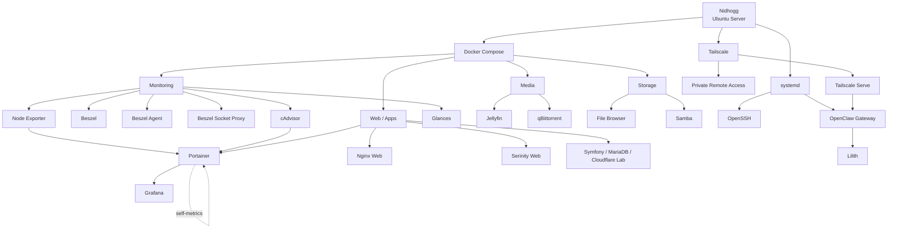
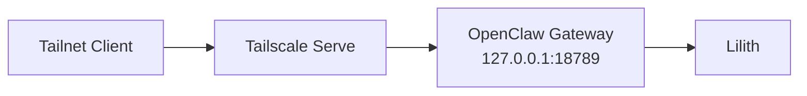

# Homelab Architecture

## Overview

Nidhogg is a single-node Ubuntu Server homelab combining:

- Docker Compose workloads
- private remote access through Tailscale
- native host services through systemd
- storage and file sharing
- monitoring
- media services
- web hosting experiments
- OpenClaw / Lilith

The goal is to keep the environment simple enough to understand while still reflecting real infrastructure patterns.

---

## High-Level Architecture



---

## Docker Layer

Most homelab services run as Docker Compose stacks.

Compose definitions currently span two locations:

```text
/srv/compose/
/srv/homelab/compose/
```

Observed Compose projects include:

```text
/srv/compose/beszel/
/srv/compose/samba/

/srv/homelab/compose/filebrowser/
/srv/homelab/compose/glances/
/srv/homelab/compose/jellyfin/
/srv/homelab/compose/monitoring/
/srv/homelab/compose/portainer/
/srv/homelab/compose/qbittorrent/
/srv/homelab/compose/serinity-web/
/srv/homelab/compose/web/
```

Each stack is kept separate to make deployment, troubleshooting, and experimentation easier.

---

## Monitoring Layer

### Beszel

Beszel provides infrastructure monitoring using three containers:

- `beszel`
- `beszel-agent`
- `beszel-socket-proxy`

The Beszel server is bound to the Tailscale interface.

The socket proxy is bound to loopback and provides restricted Docker API access for monitoring.

### Glances

Glances provides lightweight host-level monitoring and visibility into:

- CPU
- memory
- disks
- processes
- system load

---

## Media Layer

### Jellyfin

Jellyfin provides self-hosted media streaming.

### qBittorrent

qBittorrent provides download management.

Its web interface is bound to the Tailscale interface rather than exposed broadly.

---

## Storage Layer

### Samba

Samba provides LAN file sharing.

### File Browser

File Browser provides browser-based file management.

It is part of the storage and administration layer and is not intended for direct public Internet exposure.

---

## Web and Application Layer

### Nginx Web

The `nidhogg-web` container runs Nginx and publishes host port `80`.

It currently acts as the main web container on the host.

### Portainer

Portainer is used for Docker management.

It is considered an administrative interface and should remain private.

### Serinity Web

The homelab also contains a `serinity-web` Compose project and related Docker network.

### Symfony / MariaDB / Cloudflare

Nidhogg also contains web-development infrastructure built around:

- Symfony
- Nginx
- MariaDB
- Cloudflare Tunnel

These components are part of the homelab's web hosting and reverse-proxy experimentation and remain documented in the repository.

---

## Native Host Services

Not every workload runs in Docker.

Relevant host services include:

- `docker.service`
- `containerd.service`
- `tailscaled.service`
- `ssh.service`
- `openclaw-gateway.service` as a user-level systemd service

OpenClaw is intentionally managed separately from the Docker stacks.

---

## OpenClaw / Lilith

OpenClaw runs as a user-level systemd service.

The gateway listens locally on:

```text
127.0.0.1:18789
[::1]:18789
```

Tailscale provides private remote access to the gateway through Tailscale Serve.



This keeps the OpenClaw application itself bound to loopback while allowing authenticated tailnet access.

---

## Network Layers

Nidhogg uses several networking layers:

### LAN

Used for local services such as:

- Samba
- Jellyfin
- File Browser

### Tailscale

Used for private remote access to services including:

- Beszel
- qBittorrent
- OpenClaw / Lilith
- selected web services through Tailscale Serve

### Docker Networks

Docker Compose creates isolated bridge networks for individual stacks.

Observed networks include:

```text
beszel_default
filebrowser_default
jellyfin_default
monitoring
portainer_default
qbittorrent_default
samba_default
serinity_internal
web_default
```

### Loopback

Loopback-only bindings are used where a service should remain host-local.

Examples include:

```text
127.0.0.1:2375
127.0.0.1:18789
```

---

## Access Model

The homelab uses different access methods depending on service role.

| Access Type | Typical Use |
| --- | --- |
| LAN | local media, file sharing, local administration |
| Tailscale | private remote administration and service access |
| Loopback | host-local infrastructure endpoints |
| Docker network | service-to-service container communication |
| Tailscale Serve | private HTTPS access to selected local services |
| Cloudflare Tunnel | web hosting and tunnel experimentation |

Administrative interfaces and databases are not intended for direct public Internet exposure.

---

## Design Goals

The architecture is designed around:

- simple service separation
- private-by-default administration
- Docker Compose experimentation
- resource efficiency
- reproducibility
- safe remote access
- gradual infrastructure learning
- easy service replacement and iteration

---

## Notes

Nidhogg is intentionally a learning environment.

The layout evolves as new tools, services, and infrastructure patterns are tested, but the general principle remains:

> keep the system understandable, private where appropriate, and easy to rebuild.
