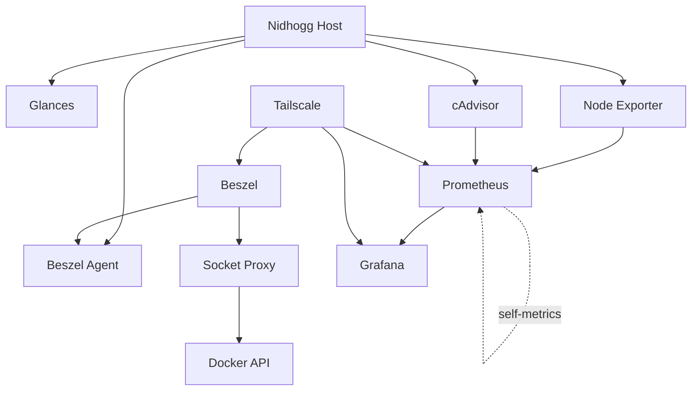

# Monitoring

## Overview

Nidhogg uses several monitoring tools to experiment with different approaches to infrastructure observability.

The monitoring environment includes:

- Beszel
- Beszel Agent
- Beszel Socket Proxy
- Prometheus
- Grafana
- Node Exporter
- cAdvisor
- Glances

These tools provide both lightweight real-time monitoring and a more traditional metrics-based observability stack.

---

## Architecture



---

## Beszel

Beszel provides lightweight infrastructure monitoring for Nidhogg.

### Components

The Beszel deployment contains:

- `beszel`
- `beszel-agent`
- `beszel-socket-proxy`

### Runtime Location

`/srv/compose/beszel/docker-compose.yml`

### Persistent Data

Known storage paths include:

- `/srv/data/beszel/hub`
- `/srv/data/beszel/agent`
- `/srv/data/beszel/socket`

### Access

The Beszel dashboard is bound to the Tailscale interface on port `8090`.

### Docker Monitoring

Beszel uses a restricted Docker socket proxy.

The proxy listens on:

`127.0.0.1:2375`

The Docker socket is mounted read-only into the proxy container.

This avoids exposing unrestricted Docker API access across the network.

---

## Prometheus

Prometheus provides metrics collection and time-series storage.

### Runtime Location

`/srv/homelab/compose/monitoring/docker-compose.yml`

### Access

Prometheus is configured on port:

`9090`

The current Compose configuration binds the interface to Tailscale.

### Configuration

Prometheus uses:

`./prometheus/prometheus.yml`

inside the monitoring Compose directory.

### Persistent Data

Prometheus data is stored at:

`/srv/homelab/data/prometheus`

Prometheus can collect metrics from infrastructure exporters such as Node Exporter and cAdvisor.

---

## Grafana

Grafana provides visualization and dashboards for collected monitoring data.

### Runtime Location

Grafana is part of:

`/srv/homelab/compose/monitoring/docker-compose.yml`

### Access

Grafana is configured on port:

`3000`

The current Compose configuration binds the dashboard to Tailscale.

### Persistent Data

Grafana state is stored at:

`/srv/homelab/data/grafana`

Grafana can use Prometheus as a metrics data source.

---

## Node Exporter

Node Exporter exposes Linux host metrics for Prometheus.

Typical metrics include:

- CPU
- memory
- filesystem usage
- load
- network interfaces
- kernel statistics

The container uses the host filesystem through a read-only mount and runs with the host PID namespace.

Node Exporter belongs to the Docker network:

`monitoring`

It does not require a published host port in the current Compose definition.

---

## cAdvisor

cAdvisor provides container-level resource metrics.

It allows Prometheus to observe Docker workload information such as:

- CPU consumption
- memory usage
- container resource statistics
- filesystem activity

The current container mounts several host resources read-only, including Docker runtime data and system information.

cAdvisor belongs to the Docker network:

`monitoring`

It does not require a published host port in the current Compose definition.

---

## Glances

Glances provides immediate real-time host inspection.

### Runtime Location

`/srv/homelab/compose/glances/docker-compose.yml`

### Image

`nicolargo/glances:latest`

### Access

The Glances web interface listens on port:

`61208`

### Host Visibility

The container uses:

- host PID namespace
- host networking
- read-only `/proc`
- read-only `/sys`
- read-only Docker socket

Glances is useful for quickly viewing:

- CPU
- memory
- disks
- processes
- system load
- Docker activity

---

## Monitoring Roles

Each monitoring component has a different purpose.

| Component | Primary Role |
| --- | --- |
| Beszel | Lightweight infrastructure dashboard |
| Beszel Agent | Beszel host/container metrics |
| Beszel Socket Proxy | Restricted Docker API access |
| Prometheus | Metrics collection and time-series storage |
| Grafana | Dashboards and visualization |
| Node Exporter | Linux host metrics |
| cAdvisor | Container metrics |
| Glances | Immediate real-time system inspection |

Beszel provides a simple monitoring experience, while Prometheus and Grafana provide a more traditional observability pipeline.

Glances remains useful for direct troubleshooting and live inspection.

---

## Monitoring Data Flow

### Beszel

```text
Beszel
   ↓
Beszel Agent
   ↓
Nidhogg metrics
```

Docker information is obtained through the restricted socket proxy.

### Prometheus / Grafana

```text
Node Exporter ──┐
                ├──> Prometheus ──> Grafana
cAdvisor ───────┘
```

Node Exporter provides host metrics.

cAdvisor provides container metrics.

Prometheus collects and stores the metrics.

Grafana visualizes the Prometheus data.

---

## Troubleshooting

### Check Beszel

```bash
cd /srv/compose/beszel
docker compose ps
```

### Check Prometheus / Grafana Stack

```bash
cd /srv/homelab/compose/monitoring
docker compose ps
```

### Check Glances

```bash
cd /srv/homelab/compose/glances
docker compose ps
```

### Check Monitoring Containers

```bash
docker ps -a --format 'table {{.Names}}\t{{.Image}}\t{{.Status}}' \
  | grep -E 'beszel|prometheus|grafana|node-exporter|cadvisor|glances'
```

### Check Monitoring Logs

```bash
cd /srv/homelab/compose/monitoring
docker compose logs --tail=100
```

These commands are read-only diagnostics.

---

## Security

Monitoring interfaces provide detailed information about the server and must remain private.

Do not expose directly to the public Internet:

- Beszel
- Grafana
- Prometheus
- Glances
- cAdvisor
- Node Exporter
- Docker socket proxy
- Docker socket

Tailscale or trusted LAN access should be used for monitoring administration.

---

## Notes

Nidhogg intentionally contains overlapping monitoring tools.

This allows experimentation with different monitoring approaches:

- Beszel for lightweight monitoring
- Prometheus and Grafana for metrics-based observability
- Glances for immediate real-time troubleshooting

The overlap is useful in a learning homelab because each tool demonstrates a different infrastructure monitoring pattern.
