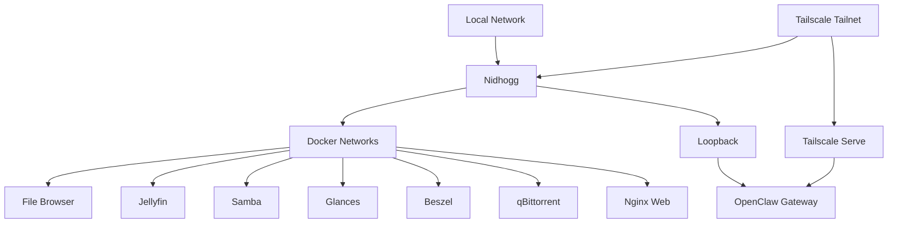

# Networking

## Overview

Nidhogg uses a layered networking model rather than a single ingress path.

The main networking layers are:

- LAN for local services
- Tailscale for private remote access
- Docker bridge networks for container communication
- loopback for host-local endpoints
- Tailscale Serve for selected private HTTPS services
- Cloudflare Tunnel and Nginx for web-hosting experimentation

Administrative interfaces and infrastructure endpoints are not intended for direct public Internet exposure.

---

## Network Overview



---

## LAN

The local network is used for services that need to be reachable by devices inside the home network.

Examples include:

- Samba
- Jellyfin
- File Browser
- Glances

A service listening on `0.0.0.0` or `[::]` is bound broadly on the host, but that alone does not mean the service is reachable from the public Internet.

Actual Internet exposure also depends on:

- router NAT / port forwarding
- host firewall rules
- upstream firewalling
- tunnel configuration
- network topology

---

## Tailscale

Tailscale provides the primary private remote-access layer for Nidhogg.

It allows tailnet devices to reach selected services without exposing those services directly to the public Internet.

Services using Tailscale-specific access include:

| Service | Port | Binding |
| --- | ---: | --- |
| Beszel | `8090` | Tailscale interface |
| qBittorrent Web UI | `8083` | Tailscale interface |
| OpenClaw | `18789` | Tailscale Serve → loopback gateway |
| Obsidian LiveSync / CouchDB | `5984` | Tailscale Serve → loopback CouchDB |
| Private web access | `443` | Tailscale Serve |

Tailscale itself also uses UDP `41641` for connectivity.

---

## Tailscale Serve

Tailscale Serve provides private HTTPS proxying for selected services.

The current design includes:

```text
Tailnet client
    ↓
Tailscale Serve
    ↓
OpenClaw Gateway
    ↓
127.0.0.1:18789
```

The main web service can also be reached privately through Tailscale Serve:

```text
Tailnet client
    ↓
Tailscale Serve
    ↓
127.0.0.1:80
    ↓
nidhogg-web
```

OpenClaw itself remains bound to loopback.

---

## Loopback Services

Some infrastructure endpoints are intentionally restricted to the local host.

| Endpoint | Purpose |
| --- | --- |
| `127.0.0.1:18789` | OpenClaw Gateway |
| `127.0.0.1:5984` | CouchDB for Obsidian LiveSync |
| `127.0.0.1:2375` | Restricted Docker socket proxy |

Loopback bindings prevent direct access from other LAN or Internet hosts.

Other software on Nidhogg can still communicate with these endpoints locally.

---

## Docker Networking

Docker Compose creates isolated networks for individual stacks.

Observed Docker networks include:

```text
beszel_default
filebrowser_default
jellyfin_default
monitoring
portainer_default
qbittorrent_default
samba_default
serinity_internal
web_default
```

These networks provide container isolation and allow services within a stack to communicate using Docker networking.

The existence of a Docker network does not by itself imply that a service is externally reachable.

---

## Host Port Bindings

Relevant host listeners include:

| Port | Service / Role | Binding |
| ---: | --- | --- |
| `22` | OpenSSH | Host interfaces |
| `80` | Nginx Web | Host interfaces |
| `443` | Tailscale Serve | Tailscale |
| `5984` | CouchDB / Obsidian LiveSync | Loopback + Tailscale Serve |
| `2375` | Beszel socket proxy | Loopback |
| `8081` | File Browser | Host interfaces |
| `8083` | qBittorrent Web UI | Tailscale |
| `8090` | Beszel | Tailscale |
| `8096` | Jellyfin | Host IPv4 |
| `18789` | OpenClaw Gateway | Loopback + Tailscale Serve |
| `61208` | Glances | Host IPv4 |
| `41641/udp` | Tailscale | Host interfaces |

These bindings describe where processes listen on Nidhogg. They should not be interpreted as proof of public Internet exposure.

---

## Nginx Web

The `nidhogg-web` container publishes:

```text
0.0.0.0:80
[::]:80
```

The container uses the `nginx:alpine` image and belongs to the `web` Compose project.

Tailscale Serve can proxy private HTTPS traffic to the local web service on port `80`.

---

## Cloudflare Tunnel

Cloudflare Tunnel remains part of Nidhogg's web-hosting and reverse-proxy experimentation.

The homelab has been used to explore traffic flows such as:

```text
Internet
    ↓
Cloudflare Tunnel
    ↓
Nginx
    ↓
Web Application
```

Cloudflare Tunnel is preferred over direct router port forwarding when intentionally publishing a web application.

Administrative services, monitoring interfaces, databases, and Docker management endpoints should not be placed on this public path.

---

## Access Principles

Nidhogg follows a few simple networking rules:

1. Prefer Tailscale for remote administrative access.
2. Keep databases and Docker management interfaces private.
3. Use loopback for host-local infrastructure endpoints where possible.
4. Use Docker networks for container-to-container communication.
5. Use LAN access where a service is intended for local devices.
6. Prefer tunnel-based publishing over router port forwarding for public web experiments.
7. Verify firewall and router configuration before assuming a broadly bound port is Internet-accessible.

---

## Security Notes

Services such as the following are not intended for direct public Internet exposure:

- Portainer
- Glances
- File Browser
- Beszel
- qBittorrent Web UI
- MariaDB
- OpenClaw
- Docker API / socket proxy

Tailscale or LAN access should be preferred for these interfaces.

Changes to firewall rules, host bindings, router forwarding, Tailscale Serve, or tunnel configuration can change the exposure of services and should be made deliberately.
